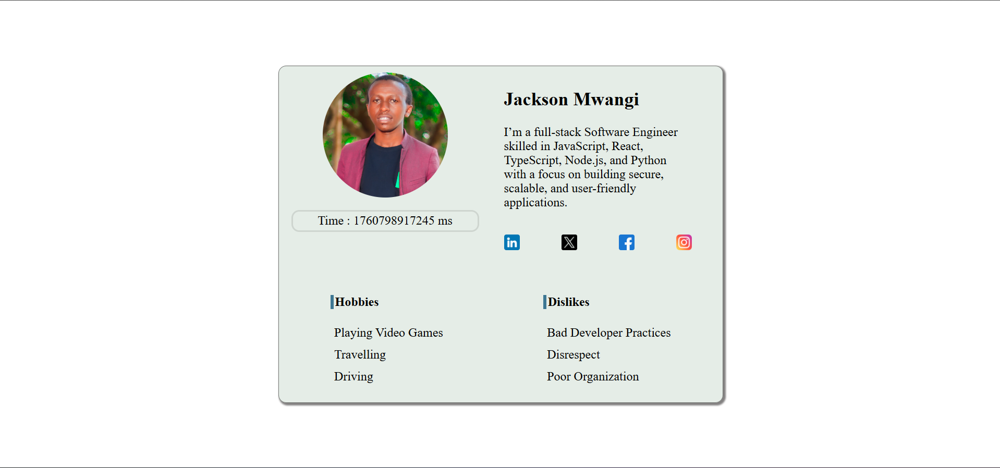
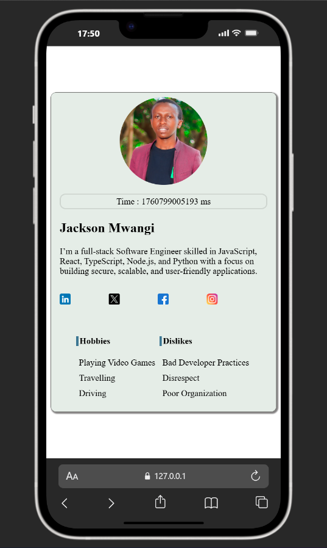

# Profile Card Component

A responsive, accessible, and testable profile card component built with semantic HTML, modern CSS, and vanilla JavaScript.

## 📋 Project Overview

This project is a **Stage 0** task for the Frontend Wizards program. It demonstrates the ability to build a well-structured, accessible, and testable web component using pure HTML, CSS, and JavaScript—no frameworks required.

## ✨ Features

- **Semantic HTML5** - Uses appropriate semantic tags for better accessibility and SEO
- **Fully Responsive** - Adapts seamlessly to mobile, tablet, and desktop viewports
- **Accessible** - WCAG compliant with keyboard navigation and ARIA attributes
- **Testable** - All elements include `data-testid` attributes for automated testing
- **Real-time Clock** - Displays current time in milliseconds using `Date.now()`
- **Avatar Upload** - Supports both URL-based images and file uploads
- **Social Media Links** - Integrated social media profile links with proper security attributes

## 🚀 Demo




**Live Demo:** [View Demo](https://user-card-hng.netlify.app/)

## 🛠️ Technologies Used

- **HTML5** - Semantic markup
- **CSS3** - Flexbox/Grid, Media Queries, Custom Properties
- **JavaScript (ES6+)** - DOM manipulation, FileReader API
- **No frameworks or libraries** - Pure vanilla implementation

## Project Structure

```
profile-card/
│
├── index.html          # Main HTML structure
├── index.css           # Styling and responsive design
├── index.js            # JavaScript functionality
├── README.md           # Project documentation
├── styles/
|   ├── about.css       # CSS for about page
|   ├── contact.css     # CSS for contact page
|   ├── index.css       # CSS for index page
│   └── main.css        # main css file
├── scripts/
│   ├── contact.js      # JavaScript for contact page
│   └── index.js        # JavaScript for index page
└── assets/
    ├── profile.jpg     # Default avatar image
    ├── linkedin.png    # LinkedIn icon
    ├── twitter.png     # Twitter icon
    ├── facebook.png    # Facebook icon
    ├── instagram.png   # Instagram icon
    ├── project_small_view.png    # Facebook icon
    └── project_wide_view.png   # Instagram icon

```

## Key Requirements Met

### Required Elements with Test IDs

| Element | Test ID | Status |
|---------|---------|--------|
| Profile Card Container | `test-profile-card` | ✅ |
| User Name | `test-user-name` | ✅ |
| User Biography | `test-user-bio` | ✅ |
| Current Time (ms) | `test-user-time` | ✅ |
| Avatar Image | `test-user-avatar` | ✅ |
| Social Links Container | `test-user-social-links` | ✅ |
| Individual Social Links | `test-user-social-{network}` | ✅ |
| Hobbies List | `test-user-hobbies` | ✅ |
| Dislikes List | `test-user-dislikes` | ✅ |

### Semantic HTML Elements Used

- `<article>` - Profile card container
- `<header>` - Card header with avatar and metadata
- `<figure>` + `` - Avatar image with semantic wrapper
- `<h1>` - User name heading
- `<p>` - Biography paragraph
- `<nav>` + `<ul>` - Social media navigation
- `<section>` - Hobbies and dislikes sections
- `<ul>` + `<li>` - List items for hobbies/dislikes

### Accessibility Features

- ✅ Semantic HTML structure
- ✅ Descriptive `alt` attributes on all images
- ✅ Keyboard-focusable interactive elements
- ✅ Visible focus indicators
- ✅ ARIA labels where appropriate
- ✅ Proper heading hierarchy
- ✅ `rel="noopener noreferrer"` on external links

### Responsive Design

- **Mobile (< 768px):** Vertical stack layout
- **Tablet (768px - 1024px):** Two-column grid
- **Desktop (> 1024px):** Optimized wide layout

## 🔧 Installation & Setup

### Prerequisites

- A modern web browser (Chrome, Firefox, Safari, Edge)
- A local web server (optional, but recommended)

### Quick Start

1. **Clone or download the repository:**
   ```bash
   git clone https://github.com/jason2000-cpu/profile-card.git
   cd profile-card
   ```

2. **Open the project:**
   
   **Option A - Direct file access:**
   ```bash
   open index.html
   # or double-click index.html
   ```

   **Option B - Local server :**
   ```bash
   # Using Python 3
   python -m http.server 8000
   
   # Using Node.js (with http-server)
   npx http-server
   
   # Using PHP
   php -S localhost:8000
   ```

3. **View in browser:**
   ```
   http://localhost:8000
   ```